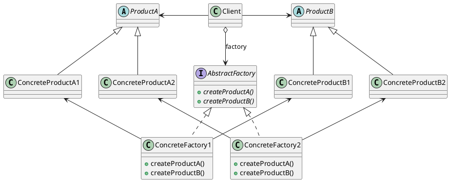

# Abstract Factory Pattern

___

### Definition

The Abstract Factory Pattern provides an interface for creating families of related or dependent objects without
specifying their concrete classes.

### Structure

### Notes

- Often methods of an Abstract Factory are implemented as factory methods.
- **Abstract Factory Interface changes if new products are added.**
- Clients get its products from concrete implementations of Abstract Factory.