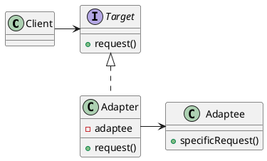

# Adapter Pattern

___

### Definition

The adapter pattern converts the interface of a class into another interface clients expect. Adapter lets classes work
together that couldn't otherwise because of incompatible interfaces.

### Structure

### Notes

- TODO: Two way adapters
- TODO: Adapter vs Facade and Decorator