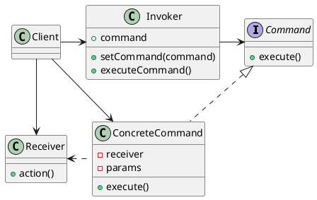

# Command Pattern

___

### Definition

### Structure

```puml
@startuml

interface Command {
    + execute()
}

class ConcreteCommand implements Command {
    - receiver
    - params
    + execute()
}

class Receiver {
    + action()
}

class Invoker {
    + command
    + setCommand(command)
    + executeCommand()
}

class Client {
}

ConcreteCommand -.left-> Receiver
Invoker -> Command
Client -> Invoker
Client -> ConcreteCommand
Client -> Receiver

@enduml
```

### Notes
