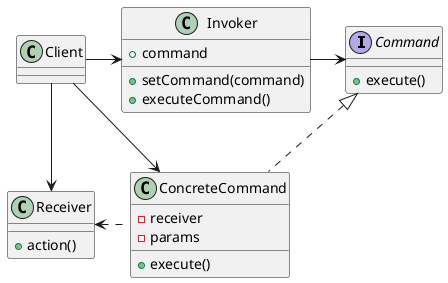

# Command Pattern

___

### Definition

The command pattern encapsulates a request as an object, and parameterize clients with different requests, queue or log
requests, and support undoable operations.

### Structure

### Notes

- The Meta Command Pattern creates macros of commands so that multiple commands can be executed at once.
- The Invoker and Receiver now both depends on Command abstraction rather than concrete classes.