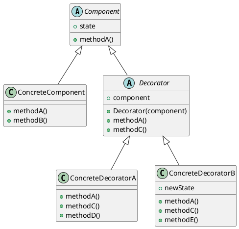

# Decorator Pattern

___

### Definition

Decorator pattern provides a flexible alternative to subclassing for attaching additional responsibilities and extending
functionality dynamically.

### Structure

### Notes

- Decorator subclasses component to inherit its type not behaviours.
- The behaviours' comes in through composition of decorators with the base components as well as other components.
- Decorators reduce the class explosion from O(mn) to O(m+n).