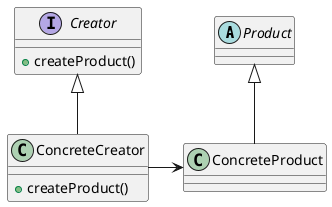

# Factory Method Pattern

___

### Definition

A factory method pattern defines an interface for creating an object, but lets the subclass decide which class to instantiate.

### Structure

class 

### Notes
- Clients implement the Creator interface directly.
- The creation of products are delegated to the implementations of Creator.
- If the client is composed of the Creator then, it becomes a specialized case of Abstract Factory Pattern.