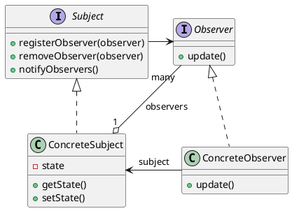

# Observer Pattern

___

### Definition

The Observer Pattern defines a one-to-many dependency between objects so that when one object changes state, all of its
dependents are notified and updated automatically.

### Structure

### Notes

- Never depend on the order of evaluation of observer notifications.

> Why? Because if you need to change Observable/Observer implementations, the order of notification could change and your application would produce incorrect results. Now that’s definitely not what we’d consider loosely coupled.

- JavaBeans have an implementation of the observer pattern with properties using
  [*
  PropertyChangeSupport*](https://docs.oracle.com/en/java/javase/11/docs/api/java.desktop/java/beans/PropertyChangeSupport.html)
  class.
