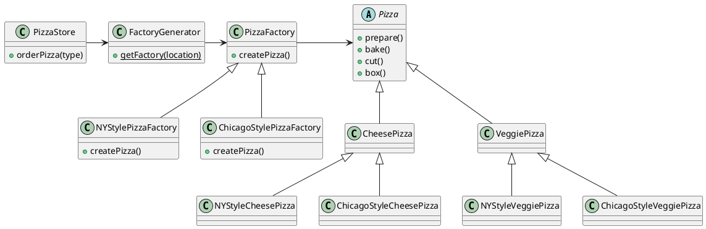

```puml
@startuml

abstract class Pizza {
    + prepare()
    + bake()
    + cut()
    + box()
}

class CheesePizza extends Pizza 
class VeggiePizza extends Pizza

class NYStyleCheesePizza extends CheesePizza
class NYStyleVeggiePizza extends VeggiePizza

class ChicagoStyleCheesePizza extends CheesePizza
class ChicagoStyleVeggiePizza extends VeggiePizza

class PizzaFactory {
    + createPizza()
}

class NYStylePizzaFactory extends PizzaFactory {
    + createPizza()
}

class ChicagoStylePizzaFactory extends PizzaFactory {
    + createPizza()
}

class FactoryGenerator {
    + {static} getFactory(location)
}

FactoryGenerator -> PizzaFactory
PizzaFactory -> Pizza

class PizzaStore {
    + orderPizza(type)
}

PizzaStore -> FactoryGenerator

@enduml
```