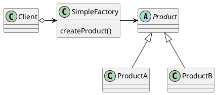

# Simple Factory

___

### Definition

Simple Factory is a programmatic idiom which simply encapsulates a piece of code that changes and get reused a lot.

### Structure

### Notes

- It doesn't totally get rid of modification but minimizes and encapsulates it in a single place.
- Very similar to Factory Method Pattern but without factory as an interface.