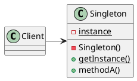

# Singleton Pattern

___

### Definition

The singleton is a design pattern that ensures a class has only one instance, while providing global access point to the
object.

### Structure

### Notes

- To make singleton threadsafe use either eager initialization, synchronization or double-checked locking.
- Be aware if using multiple class loaders, this could defeat singleton implementation and result in multiple instances.