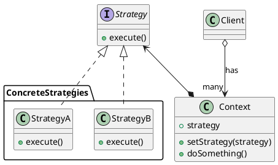

# Strategy Pattern

___

### Definition

The Strategy Pattern defines a family of algorithms, encapsulates each one, and makes them interchangeable. Strategy
lets the algorithm vary independently of clients that use it.

### Structure

