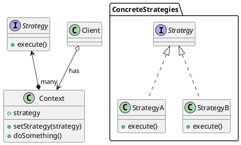

# Strategy Pattern

___

### Definition

The Strategy Pattern defines a family of algorithms, encapsulates each one, and makes them interchangeable. Strategy
lets the algorithm vary independently of clients that use it.

### Structure

### Notes

- A more modern approach of implementing the concrete strategies is to use predeclared anonymous functions or lambdas,
  which behaves the same but without bloating code with extra classes.